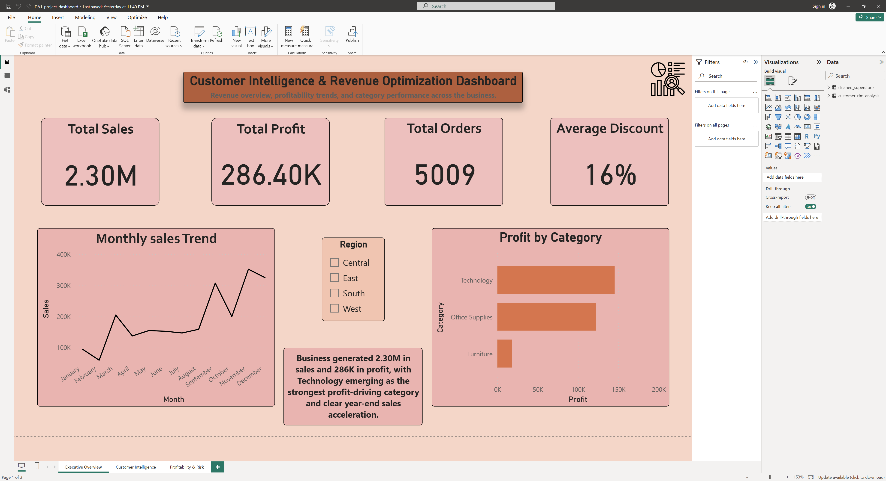
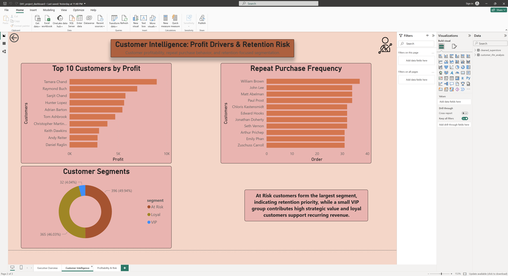
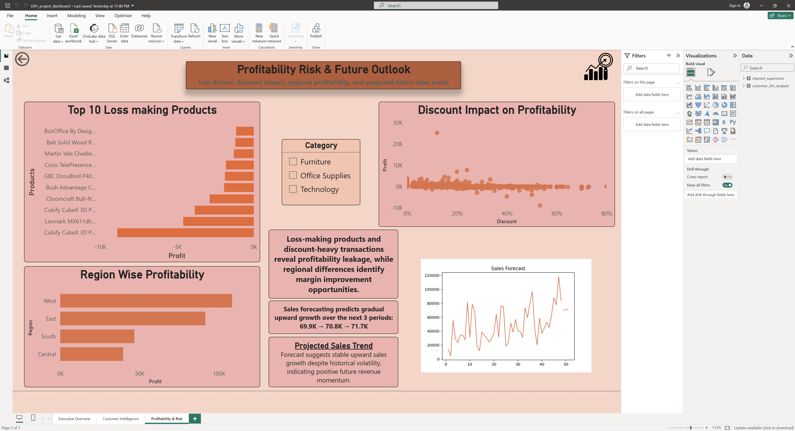

# Customer Intelligence & Revenue Optimization Dashboard

## Project Overview

This project is an end-to-end retail analytics solution built to analyze customer behavior, profitability drivers, business risks, and future sales trends using Python, PostgreSQL, and Power BI.

The project focuses on transforming transactional retail data into actionable business insights through data cleaning, SQL analysis, customer segmentation, forecasting, and dashboard storytelling.

---

## Tools Used

* Python (Pandas, Matplotlib, Scikit-learn)
* PostgreSQL
* Power BI

---

## Business Objectives

* Analyze overall sales and profitability performance
* Identify top customers and repeat purchase behavior
* Detect loss-making products
* Evaluate discount impact on profit
* Segment customers using RFM analysis
* Forecast future sales trend

---

## Project Workflow

1. Data cleaning and preprocessing in Python
2. Business analysis queries in PostgreSQL
3. Customer segmentation using RFM model
4. Sales forecasting using Linear Regression
5. Interactive 3-page Power BI dashboard

---

## Key Insights

* Business generated 2.30M sales and 286K profit
* Technology category delivered highest profitability
* At Risk customers formed the largest customer segment
* Some products consistently generated negative profit
* Higher discount levels reduced profitability
* Forecast indicated gradual upward sales trend

---

## Dashboard Pages

### Page 1 — Executive Overview

Revenue overview, profitability trends, and category performance.

### Page 2 — Customer Intelligence

Top customers, repeat purchase behavior, and retention risk segmentation.

### Page 3 — Profitability Risk & Future Outlook

Loss drivers, discount impact, regional profitability, and sales forecast.

---

## Files Included

* Cleaned dataset
* SQL analysis queries
* Python segmentation and forecasting outputs
* Power BI dashboard file

---

## Business Outcome

The dashboard helps identify profit drivers, customer retention priorities, margin leakage, and expected future revenue direction.
